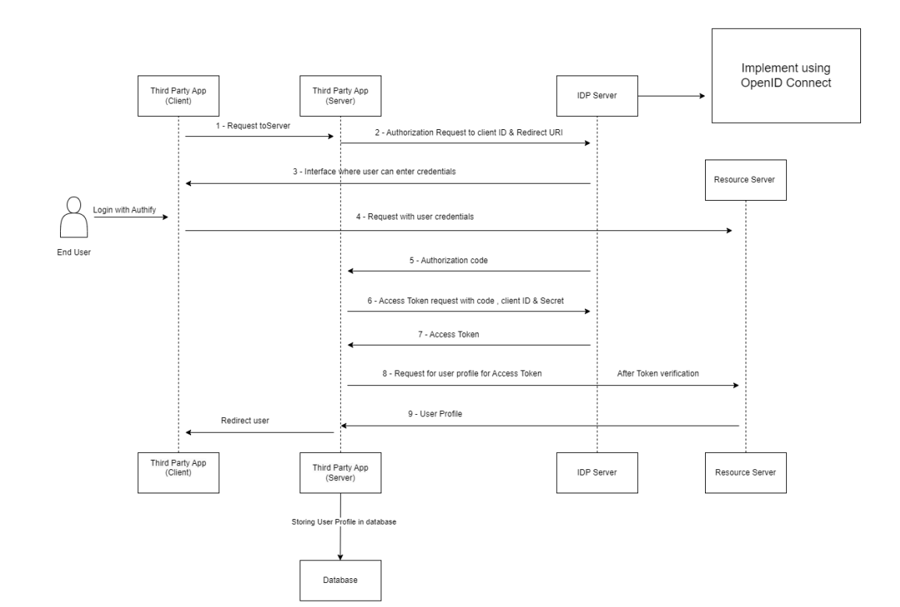
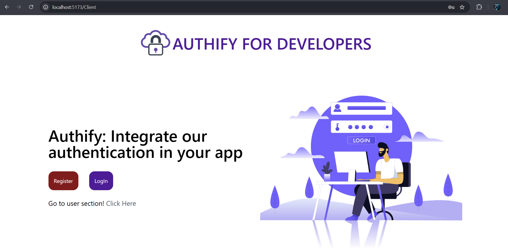
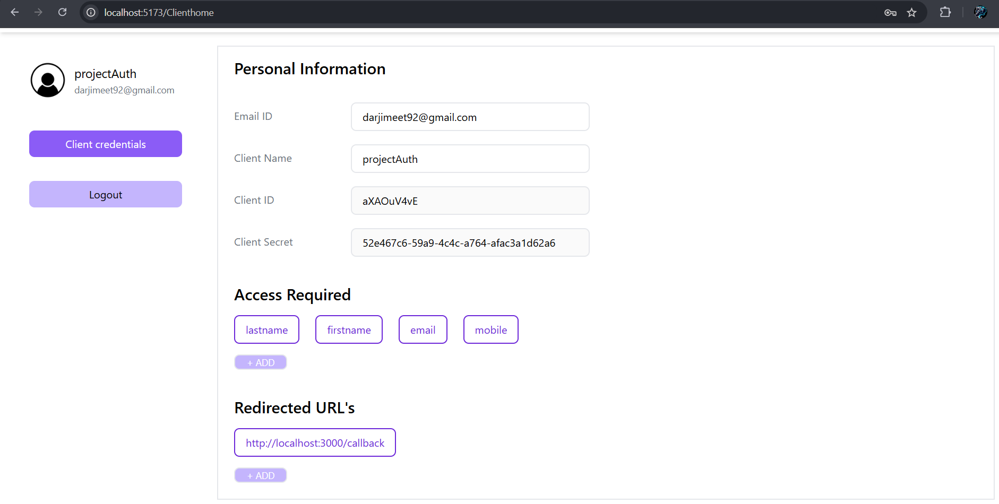
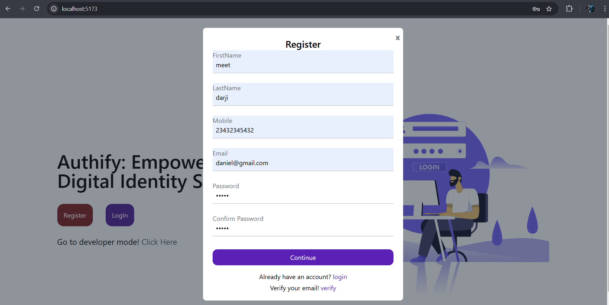
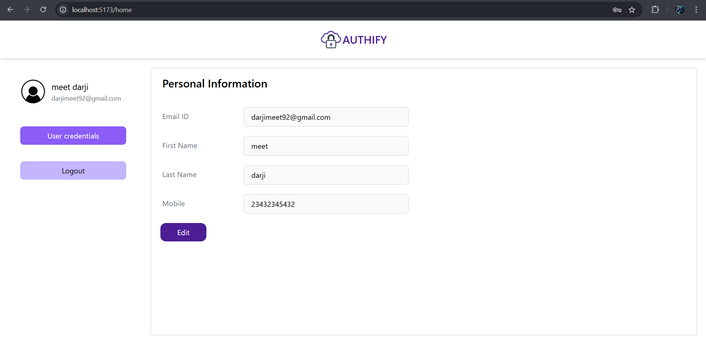
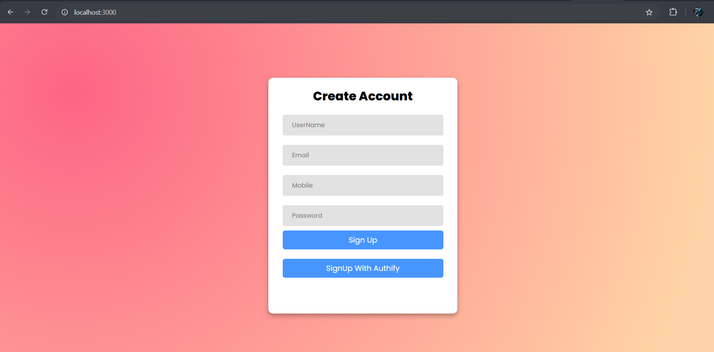
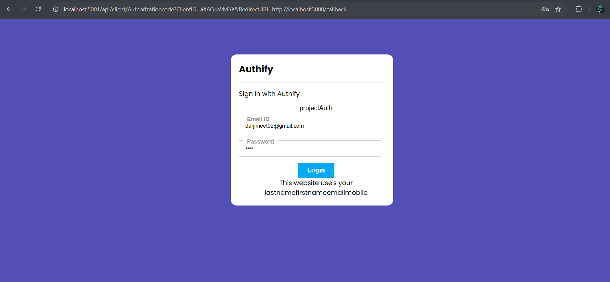

 <h1>Custom SSO Implementation using OAuth 2.0 and OpenID</h1>

  <h2>Table of Contents</h2>
  <ul>
    <li><a href="#project-overview">Project Overview</a></li>
    <li><a href="#features">Features</a></li>
    <li><a href="#tech-stack">Tech Stack</a></li>
    <li><a href="#OpenId_Flow_Diagram">OpenId Flow Diagram</a></li>
    <li><a href="#screenshots">Screenshots</a></li>
    <li><a href="#future-enhancements">Future Enhancements</a></li>
  </ul>

  <h2 id="project-overview">Project Overview</h2>
  
This project demonstrates a <strong>Custom Single Sign-On (SSO)</strong> solution using <strong>OAuth 2.0</strong> and <strong>OpenID</strong> protocols. It provides secure user authentication and centralized login management for applications.

  <h2 id="features">Features</h2>
  <ul>
    <li>Secure user authentication via OAuth 2.0 and OpenID.</li>
    <li>Token-based session management using JSON Web Tokens (JWT).</li>
    <li>MongoDB for user and session data storage.</li>
    <li>React.js frontend for a seamless user experience.</li>
    <li>Node.js and Express.js backend.</li>
    <li>Role-based access control for enhanced security.</li>
  </ul>

   <h2 id="tech-stack">Tech Stack</h2>
  <ul>
    <li><strong>Frontend:</strong> React.js, Tailwind CSS (optional).</li>
    <li><strong>Backend:</strong> Node.js, Express.js.</li>
    <li><strong>Database:</strong> MongoDB.</li>
    <li><strong>Authentication Protocols:</strong> OAuth 2.0, OpenID.</li>
    <li><strong>Utilities:</strong> JWT, bcrypt for password hashing.</li>
  </ul>

   <h2 id="OpenId_Flow_Diagram">OpenId Flow Diagram</h2>
   

   <h2 id="screenshots">Some ScreenShots</h2>
   <h3>For Client</h3>
   
   
   
   
   <h3>For User</h3>
   
   
   

   <h3>SSO Integration in Client's Website in</h3>
   
   
   
   
