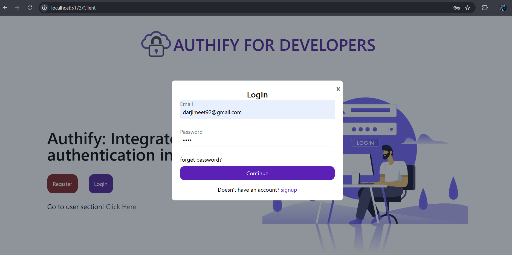
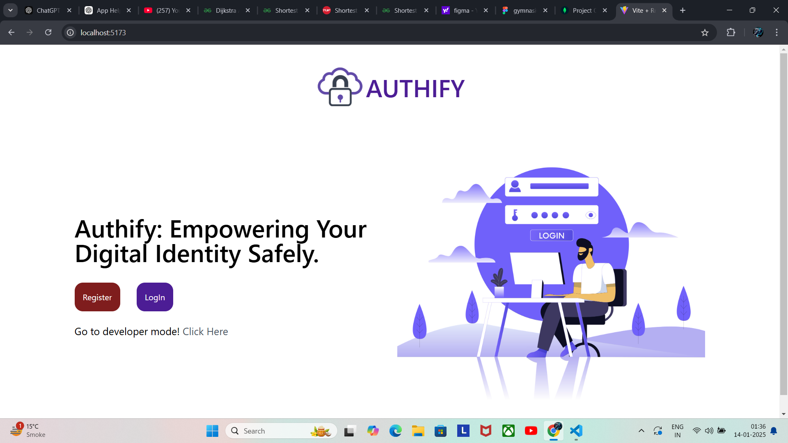

 <h1>Custom SSO Implementation</h1>
 
Implemented OAuth2.0 and OpenID protocol from scratch for creating providing signing functionality to developer same like google provides its LogIn with google functionality.

  <h2>Table of Contents</h2>
  <ul>
    <li><a href="#project-overview">Project Overview</a></li>
    <li><a href="#features">Features</a></li>
    <li><a href="#tech-stack">Tech Stack</a></li>
    <li><a href="#OpenId_Flow_Diagram">OpenId Flow Diagram</a></li>
    <li><a href="#screenshots">Screenshots</a></li>
    <li><a href="#future-enhancements">Future Enhancements</a></li>
    <li><a href="#configuration">Configuration</a></li>
  </ul>

  <h2 id="project-overview">Project Overview</h2>
  
This project demonstrates a <strong>Custom Single Sign-On (SSO)</strong> solution using <strong>OAuth 2.0</strong> and <strong>OpenID</strong> protocols. It provides secure user authentication and centralized login management for applications.

  <h2 id="features">Features</h2>
  <ul>
    <li>Secure user authentication via OAuth 2.0 and OpenID.</li>
    <li>Token-based session management using JSON Web Tokens (JWT).</li>
    <li>MongoDB for user and session data storage.</li>
    <li>React.js frontend for a seamless user experience.</li>
    <li>Node.js and Express.js backend.</li>
    <li>Role-based access control for enhanced security.</li>
  </ul>

   <h2 id="tech-stack">Tech Stack</h2>
  <ul>
    <li><strong>Frontend:</strong> React.js, Tailwind CSS (optional).</li>
    <li><strong>Backend:</strong> Node.js, Express.js.</li>
    <li><strong>Database:</strong> MongoDB.</li>
    <li><strong>Authentication Protocols:</strong> OAuth 2.0, OpenID.</li>
    <li><strong>Utilities:</strong> JWT, bcrypt for password hashing.</li>
  </ul>

   <h2 id="OpenId_Flow_Diagram">OpenId Flow Diagram</h2>
   

   <h2 id="screenshots">Some ScreenShots</h2>
   <h3>For Client</h3>
   
   
   
   
   <h3>For User</h3>
   
   
   

   <h3>SSO Integration in Client's Website in</h3>
   
   

   <h2 id="configuration">Configuration</h2>
   <h3>.Env for backend</h3>
  // Server Configuration  
   PORT=5000
   NODE_ENV=development
   
   // MongoDB Configuration  
   MONGO_URI=your-mongodb-connection-string
   
   // JWT Secrets  
   JWT_SECRET=your-jwt-secret
   JWT_SECRET_CLIENT=your-client-jwt-secret
   
   // Mailtrap Configuration  
   MAILTRAP_TOKEN=your-mailtrap-token
   MAILTRAP_ENDPOINT=your-mailtrap-endpoint
   
   // Client Configuration  
   CLIENT_URL=http://localhost:5173 (frontend)
   
   // Identity Provider (IDP) Configuration  
   IDP_SERVER_JWT_SECRET=your-idp-server-jwt-secret
   IDP_SERVER_AUTH=your-idp-auth-secret

   <h3>.Env for idp_server</h3>
   // MongoDB URI for connecting to the database  
   MONGO_URI=your-mongodb-uri
   
   // Server configuration  
   PORT=5001
   NODE_ENV=development
   
   // JWT secrets used for token generation  
   JWT_SECRET=your-jwt-secret
   JWT_SECRET_CLIENT=your-client-jwt-secret
   
   // Client and Resource Server configuration  
   CLIENT_URL=http://localhost:5173 (frontend)
   RESOURCE_SERVER=http://localhost:5000
   
   // Encryption key for securing sensitive data  
   ENCRYPTION_KEY=your-encryption-key
   
   // IDP server authentication secret  
   IDP_SERVER_AUTH=your-idp-auth-secret

   (Note: backend is a resource server)

   
   
